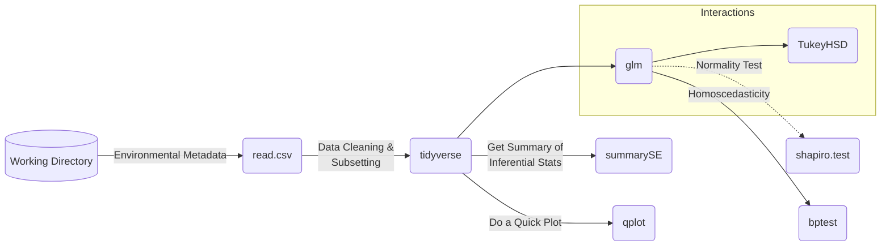
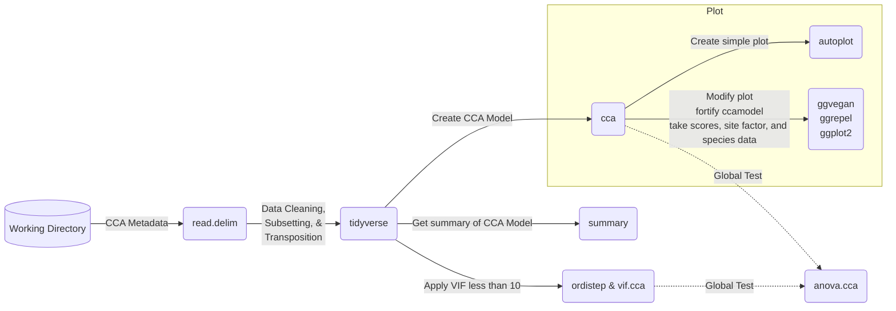

```mermaid
flowchart LR
id1[(Working Directory)] --> |KO Metadata| B(read.csv)
B --> |Data Cleaning,</br>Subsetting otu_table,tax_table,sample_data, &</br>String Factor to Character| C(tidyverse)
C --> |convert to data matrix| D(as.matrix)
D--> |create large phyloseq object| E(phyloseq)
E --> |convert phyloseq to deseq|F(phyloseq_to_deseq2)
F-. Investigate test result .->G(results)
subgraph Statistics
direction BT
G-->|Create padj and log2Foldchange threshold|H(new vector)
H--> |Add vector to results| I(new results)
I--> |Subset, Filter results, and</br>write as new dataframe| J(Dataframe for contrast and plotting)
%%Thresholds applied here are 0.05 for padj.cutoff and 0.58 lfc.cutoff
end
```

# Practice | Mermaid-Markdown
 
<h3 align="left">Objective:</h3>
  To practice creating a simple flowchart for each of my research method
  
<h3 align="left">References:</h3>
  https://github.blog/2022-02-14-include-diagrams-markdown-files-mermaid/
  https://tuts.alexmercedcoder.dev/2022/2/why-all-developers-should-master-markdown/
  https://mermaid-js.github.io/mermaid/#/n00b-syntaxReference
  
<h3 align="left">Note:</h3>
  Read syntax and Beginner's Guide
  
  ```mermaid
  graph TD;
  Raw_Data-->Backup_Data;
  Raw_Data-->Process_Data;
  Process_Data-->Clean_Data;
  Clean_Data-->R;
  R-->Statistical_Analyses;
  Statistical_Analyses-->Data_visualizations;
  ```
  
<h3 align="left">Physicochemical & Physiological Data:</h3>
  


<h3 align="left">CCA Data:</h3>


<h3 align="left">Predictive Function Data:</h3>



```mermaid
graph LR;
id1{Dataframe for contrast and plotting} -->B(Ctenidia vs Mantle)
